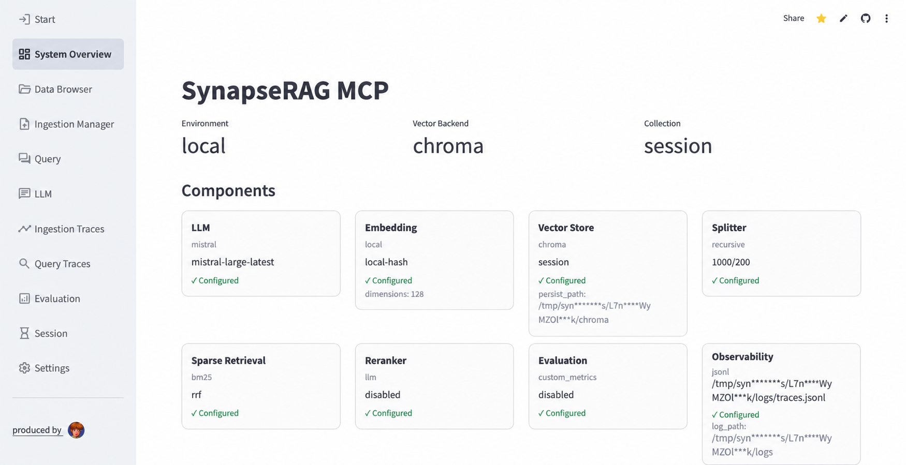

# SynapseRAG-MCP

[English](../README.md) | [中文](README.zh-CN.md) | [Dansk](README.da.md) | [Deutsch](README.de.md)

SynapseRAG-MCP ist ein modulares RAG-System (Retrieval-Augmented Generation): Jede Stufe der Pipeline — Splitting, Embedding, hybride Dense- + Sparse-Suche mit RRF-Fusion, Reranking und Antwortgenerierung — ist eine austauschbare Komponente mit wechselbaren Anbietern. Enthalten sind ein MCP-Server, über den Agenten deine Wissensbasis direkt abfragen können, sowie ein Streamlit-Dashboard für Ingestion, Traces, Evaluation und Live-Konfiguration. Lokal im eigenen Stack betreiben oder öffentlich bereitstellen — mit Isolation pro Sitzung und einer Daten-TTL von einer Stunde.

**[Live-Demo ausprobieren →](https://synapserag-mcp-server.streamlit.app)**



## Installation

```bash
pip install -r requirements.txt
```

## Dashboard starten

Lokaler Modus — vollständiges Dashboard, liest `config/settings.yaml`, keine Maskierung:

```bash
python scripts/start_dashboard.py
```

## Dateien importieren

```bash
python scripts/ingest.py --path pdfs/
python scripts/ingest.py --path pdfs/example.pdf
python scripts/ingest.py --path pdfs/ --collection my_docs
python scripts/ingest.py --path pdfs/ --force
```

## Abfrage

```bash
python scripts/query.py --query "your question"
python scripts/query.py --query "your question" --top-k 5 --collection my_docs
python scripts/query.py --query "your question" --verbose
```

## Auswerten

```bash
python scripts/evaluate.py
```

## Tests ausführen

```bash
pytest
pytest -m unit
```

## Deployment (Streamlit Community Cloud)

Der öffentliche Modus stellt dasselbe Dashboard mit zusätzlichen Start- (Anmeldung) und Session-Seiten bereit: Isolation des Arbeitsbereichs pro Browsersitzung, eine Stunde Daten-TTL sowie Maskierung lokaler Pfade und Secrets für Gäste (Administratoren sehen unmaskierte Daten).

```bash
streamlit run streamlit_app.py
```

1. Dieses Repository zu GitHub pushen und auf share.streamlit.io eine App mit dem Entrypoint `streamlit_app.py` erstellen.
2. In den App-Einstellungen unter Settings → Secrets konfigurieren:

```toml
ADMIN_PASSWORD = "change-me-to-a-long-random-string"
OWNER_LLM_PROVIDER = "openai"
OWNER_LLM_MODEL = "example-model-name"
OWNER_LLM_BASE_URL = "https://api.example-llm.com/v1"
OWNER_LLM_API_KEY = "sk-example-fake-key-000000"

# Optional: echtes Embedding-Modell für Admin-Sitzungen (Gäste nutzen immer kostenloses lokales Hashing)
OWNER_EMBEDDING_PROVIDER = "openai"
OWNER_EMBEDDING_MODEL = "BAAI/bge-m3"
OWNER_EMBEDDING_BASE_URL = "https://api.siliconflow.cn/v1"
OWNER_EMBEDDING_API_KEY = "sk-example-fake-key-000000"
OWNER_EMBEDDING_DIMENSIONS = "1024"
```

3. Im Dashboard deines LLM-Anbieters ein Ausgabenlimit setzen — die eingebaute Owner-Quote (30 Aufrufe/Stunde, 200/Tag) wird bei Prozessneustart zurückgesetzt.
4. Gäste starten eine Sitzung und konfigurieren auf der Settings-Seite ihr eigenes LLM, Embedding-Modell und Rerank-Optionen (werden nur im Arbeitsspeicher gehalten); die Suche funktioniert sofort mit dem kostenlosen lokalen Hash-Embedding.

`.streamlit/secrets.toml` ist per Git ignoriert; niemals echte Zugangsdaten committen.

## Lizenz

[GNU AGPL-3.0](../LICENSE) © 2026 Theo Zou
